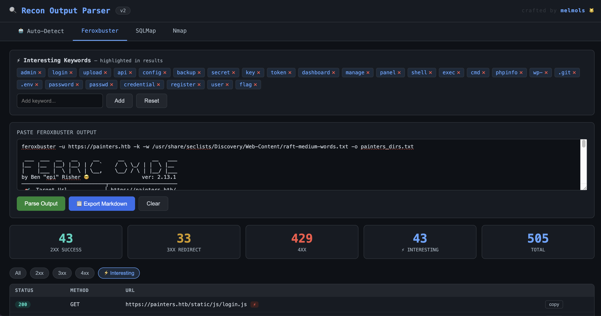

# WRP - Web Recon Parser

A browser-based tool for parsing and visualizing output from common recon/enumeration tools used in penetration testing and CTF challenges.



**Author:** melmols

## Requirements

Any modern browser (Chrome, Firefox, Edge, Safari). No install, no server, no internet connection required.

## Installation
- git clone https://github.com/melmols/WebReconParser
- cd `WebReconParser`
- open `wrp.html`

## Overview

`wrp.html` is a single-file, offline HTML tool. No server, no dependencies, no data leaves your machine. Open it directly in any modern browser.

## Supported Tools

| Tab | Tool | Output Parsed |
|-----|------|---------------|
| 🤖 Auto-Detect | — | Detects tool type automatically and routes to the correct parser |
| Feroxbuster | `feroxbuster` | HTTP responses: status codes, URLs, methods |
| SQLMap | `sqlmap` | Injection verdicts, vulnerable params, DB/OS/tech fingerprint, warnings |
| Nmap | `nmap` | Hosts, open ports, services, versions, OS detection, NSE script output |

### Feroxbuster

Parses directory and file brute-force output from `feroxbuster`.

- Status code summary (2xx / 3xx / 4xx / 5xx counts)
- Filterable results table: filter by status code or interesting paths only
- Configurable keyword highlighting for high-value paths (`admin`, `api`, `.git`, `.env`, etc.)
- One-click URL copy to clipboard

### SQLMap

Parses SQL injection scan output from `sqlmap`.

- Injection verdict and vulnerable parameter detection
- Database, OS, and technology fingerprint extraction
- Warnings and errors surfaced separately
- Suggested next-step commands for confirmed injections

### Nmap

Parses host and port scan output from `nmap` (`-sV -sC` style).

- Host discovery with open port and service listing
- Version banners and OS detection results
- NSE script output displayed inline
- Inline attack notes for 40+ common ports (SMB, WinRM, Redis, RDP, etc.)
- Key Observations panel: CMS/framework from `http-generator`, mail hostnames from SSL cert CNs and SANs, all discovered domains
- Next Steps panel: `/etc/hosts` entries ready to copy, web URLs to browse (HTTP/HTTPS ports, mail hosts excluded)

## Features

- **Auto-detect:** paste any tool output and it figures out the format
- **Summary cards:** instant counts for 2xx/3xx/4xx, vuln params, interesting ports
- **Filterable tables:** filter Feroxbuster results by status code or "interesting" paths
- **Interesting keyword highlighting:** configurable keyword list flags high-value paths (admin, login, api, .git, .env, etc.)
- **Nmap port notes:** known attack vectors shown inline for 40+ common ports (SMB, WinRM, Redis, etc.)
- **Key Observations panel:** surfaces CMS/framework detections (http-generator) and mail hostnames from SSL certs above the port table
- **Next Steps panel:** auto-generates `/etc/hosts` entries from discovered hostnames and lists web targets to browse based on open HTTP/HTTPS ports
- **Next steps guidance:** SQLMap results include suggested follow-up commands
- **Markdown export:** export any parsed result as a formatted Markdown table for notes/reports
- **Copy to clipboard:** one-click URL copying from Feroxbuster results

## Usage

1. Open `wrp.html` in a browser (no web server needed) - can be used offline for engagements too.
2. Either:
   - Use the **Auto-Detect** tab and paste any supported output, or
   - Select the specific tool tab and paste the raw terminal output
3. Click **Parse Output** (or **Detect & Parse** in Auto mode)
4. Use filters and tables to triage results
5. Click **Export Markdown** to copy a formatted report

## Example Workflow

Run your tool and save output, then paste into the parser:

```bash
# Feroxbuster
feroxbuster -u http://10.10.10.10 -w /usr/share/wordlists/dirb/common.txt | tee ferox_out.txt

# SQLMap
sqlmap -u "http://10.10.10.10/login.php" --data="user=a&pass=b" | tee sqlmap_out.txt

# Nmap
nmap -sV -sC -p- 10.10.10.10 | tee nmap_out.txt
```

Then open `wrp.html`, paste the contents of any output file, and hit **Detect & Parse**.

## Default Interesting Keywords

`admin` `login` `upload` `api` `config` `backup` `secret` `key` `token` `dashboard` `manage` `panel` `shell` `exec` `cmd` `phpinfo` `wp-` `.git` `.env` `password` `passwd` `credential` `register` `user` `flag`

Keywords can be added/removed/reset from the Feroxbuster tab.

## Nmap Coverage

Flags interesting ports including: FTP, SSH, Telnet, SMTP, DNS, HTTP/S, Kerberos, SNMP, LDAP, SMB, MSSQL, MySQL, PostgreSQL, RDP, WinRM, Redis, VNC, MongoDB, Elasticsearch, NFS, Rsync, and more.

## Privacy

All processing is done client-side in JavaScript. No data is sent anywhere.
